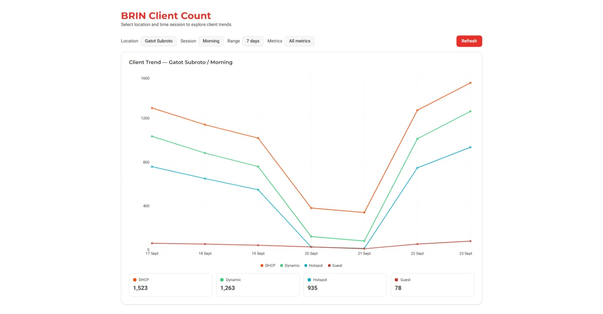

# BRIN Client Count Dashboard

A modern, high-performance dashboard for monitoring BRIN client counts across different locations and time sessions. Built with Next.js 15, React 19, and optimized for speed and user experience.



## 🚀 Features

### Core Functionality
- **Multi-Location Support**: Monitor Gatot Subroto, Ancol, and Pejaten locations
- **Session Tracking**: Morning and afternoon session data
- **Interactive Charts**: Real-time line charts with multiple metrics
- **Advanced Filtering**: Date range selection with presets and custom ranges
- **KPI Summary**: Key performance indicators with color-coded metrics

### Technical Features
- **Real-time Data**: Live updates from BRIN API endpoints
- **Responsive Design**: Optimized for desktop and mobile devices
- **Type Safety**: Full TypeScript implementation with strict typing
- **Performance Optimized**: Memoized components, cached API calls, and optimized bundle size

## 🛠 Technologies Used

- **Framework**: Next.js 15 (App Router)
- **Language**: TypeScript
- **Styling**: Tailwind CSS + shadcn/ui components
- **Charts**: Recharts (optimized and memoized)
- **State Management**: React hooks with optimizations
- **Build Tool**: Turbopack (fast builds)
- **Package Manager**: PNPM

## 📊 API Integration

Connects to BRIN client count endpoints:
- `http://10.13.222.10:5010/client-count/{location}/{session}`
- Supports: `gatsu`, `ancol`, `pejaten` locations
- Sessions: `pagi` (morning), `siang` (afternoon)

## ⚡ Performance Optimizations

### Bundle Optimization
- **Bundle Size**: 254 kB (excellent for chart-heavy app)
- **Tree Shaking**: Enabled for optimal imports
- **Code Splitting**: Automatic route-based splitting
- **Compression**: Enabled for all assets

### React Optimizations
- **React.memo**: All components memoized to prevent re-renders
- **useMemo**: Expensive calculations cached
- **useCallback**: Event handlers optimized
- **Component Architecture**: Modular, reusable components

### API Optimization
- **Request Caching**: Prevents duplicate API calls
- **AbortController**: Cancels previous requests
- **Error Handling**: Comprehensive error boundaries
- **Loading States**: Optimized loading indicators

### Build Optimizations
- **Build Time**: ~7s (optimized with Turbopack)
- **Static Generation**: Pre-rendered pages
- **Image Optimization**: WebP/AVIF support
- **Font Optimization**: Display swap for faster loading

## 🚀 Getting Started

### Prerequisites
- Node.js 18+
- PNPM package manager

### Installation

```bash
# Clone the repository
git clone https://github.com/NojinNojs/brin-client-count.git
cd brin-client-count

# Install dependencies
pnpm install

# Start development server
pnpm dev
```

Open [http://localhost:3000](http://localhost:3000) to view the dashboard.

### Build for Production

```bash
# Build optimized production version
pnpm build

# Start production server
pnpm start
```

## 🐳 Docker Setup

### Prerequisites

#### Install Docker (Jika belum ada)

<details>
<summary><strong>🪟 Windows</strong></summary>

1. **Download Docker Desktop for Windows**
   - Kunjungi: https://www.docker.com/products/docker-desktop/
   - Download Docker Desktop Installer

2. **Install Docker Desktop**
   - Jalankan installer sebagai Administrator
   - Ikuti wizard installation
   - Restart komputer jika diminta

3. **Verify Installation**
   ```cmd
   docker --version
   docker-compose --version
   ```

4. **Enable WSL 2 (Recommended)**
   - Install WSL 2: https://docs.microsoft.com/en-us/windows/wsl/install
   - Enable WSL 2 integration di Docker Desktop settings

</details>

<details>
<summary><strong>🍎 macOS</strong></summary>

1. **Download Docker Desktop for Mac**
   - Kunjungi: https://www.docker.com/products/docker-desktop/
   - Pilih versi sesuai chip (Intel atau Apple Silicon)

2. **Install Docker Desktop**
   - Drag Docker.app ke Applications folder
   - Buka Docker Desktop dari Applications
   - Ikuti setup wizard

3. **Verify Installation**
   ```bash
   docker --version
   docker-compose --version
   ```

</details>

<details>
<summary><strong>🐧 Linux (Ubuntu/Debian)</strong></summary>

1. **Install Docker Engine**
   ```bash
   # Update package index
   sudo apt update
   
   # Install required packages
   sudo apt install apt-transport-https ca-certificates curl gnupg lsb-release
   
   # Add Docker's official GPG key
   curl -fsSL https://download.docker.com/linux/ubuntu/gpg | sudo gpg --dearmor -o /usr/share/keyrings/docker-archive-keyring.gpg
   
   # Add Docker repository
   echo "deb [arch=$(dpkg --print-architecture) signed-by=/usr/share/keyrings/docker-archive-keyring.gpg] https://download.docker.com/linux/ubuntu $(lsb_release -cs) stable" | sudo tee /etc/apt/sources.list.d/docker.list > /dev/null
   
   # Install Docker Engine
   sudo apt update
   sudo apt install docker-ce docker-ce-cli containerd.io docker-compose-plugin
   ```

2. **Add user to docker group**
   ```bash
   sudo usermod -aG docker $USER
   newgrp docker
   ```

3. **Verify Installation**
   ```bash
   docker --version
   docker compose version
   ```

</details>

### 🚀 Quick Start with Docker

#### Option 1: Using Docker Hub Images (Recommended untuk yang tidak punya source code)

```bash
# Production mode (dari Docker Hub)
npm run docker:hub
# atau
docker-compose --profile hub up

# Development mode (dari Docker Hub)
npm run docker:hub-dev
# atau
docker-compose --profile hub-dev up
```

#### Option 2: Local Build (untuk development)

```bash
# Development mode (build lokal)
npm run docker:dev
# atau
docker-compose --profile dev up --build

# Production mode (build lokal)
npm run docker:prod
# atau
docker-compose --profile prod up --build
```

### 📦 Manual Docker Commands

#### Using Docker Hub Images
```bash
# Pull dan run production image
docker run -p 3000:3000 nojinnojs/brin-client-count:latest

# Pull dan run development image
docker run -p 3000:3000 -v $(pwd):/app -v /app/node_modules nojinnojs/brin-client-count:dev
```

#### Build and Run Locally
```bash
# Build production image
npm run docker:build

# Build development image
npm run docker:build-dev

# Run production container
npm run docker:run

# Run development container
npm run docker:run-dev

# Clean up Docker resources
npm run docker:clean
```

#### Docker Hub Management (untuk maintainer)
```bash
# Tag images untuk Docker Hub
npm run docker:tag

# Push images ke Docker Hub
npm run docker:push
```

### 🎯 Platform-Specific Commands

<details>
<summary><strong>Windows (PowerShell/CMD)</strong></summary>

```powershell
# PowerShell
docker run -p 3000:3000 nojinnojs/brin-client-count:latest

# Development dengan volume mounting
docker run -p 3000:3000 -v ${PWD}:/app -v /app/node_modules nojinnojs/brin-client-count:dev

# Docker Compose
docker-compose --profile hub up
```

</details>

<details>
<summary><strong>macOS (Terminal)</strong></summary>

```bash
# Production
docker run -p 3000:3000 nojinnojs/brin-client-count:latest

# Development
docker run -p 3000:3000 -v $(pwd):/app -v /app/node_modules nojinnojs/brin-client-count:dev

# Docker Compose
docker compose --profile hub up
```

</details>

<details>
<summary><strong>Linux (Terminal)</strong></summary>

```bash
# Production
docker run -p 3000:3000 nojinnojs/brin-client-count:latest

# Development
docker run -p 3000:3000 -v $(pwd):/app -v /app/node_modules nojinnojs/brin-client-count:dev

# Docker Compose
docker compose --profile hub up
```

</details>

### 🔧 Docker Features
- **Multi-stage build** - Optimized production image size (~150MB)
- **Security** - Non-root user execution
- **Hot reload** - Development mode with volume mounting
- **Profile separation** - Dev, prod, dan hub environments
- **Health checks** - Built-in health monitoring
- **Cross-platform** - Works on Windows, macOS, Linux
- **Docker Hub ready** - Pre-built images available

### 🌐 Container Access
- **Development**: http://localhost:3000 (with hot reload)
- **Production**: http://localhost:3000 (optimized build)
- **Health Check**: http://localhost:3000/api/health

### 🐛 Troubleshooting

#### Common Issues

<details>
<summary><strong>Port already in use</strong></summary>

```bash
# Windows/Linux
netstat -ano | findstr :3000
# Kill process using port 3000
taskkill /PID <PID> /F

# macOS/Linux
lsof -ti:3000 | xargs kill -9
```

</details>

<details>
<summary><strong>Permission denied (Linux)</strong></summary>

```bash
# Add user to docker group
sudo usermod -aG docker $USER
newgrp docker

# Or run with sudo
sudo docker run -p 3000:3000 nojinnojs/brin-client-count:latest
```

</details>

<details>
<summary><strong>Docker not running</strong></summary>

```bash
# Start Docker Desktop (Windows/macOS)
# Or start Docker service (Linux)
sudo systemctl start docker
sudo systemctl enable docker
```

</details>

## 🎨 UI Components

### Dashboard Features
- **Location Dropdown**: Select between Gatot Subroto, Ancol, Pejaten
- **Session Dropdown**: Choose Morning or Afternoon sessions
- **Range Filter**: 7 days, 1 month, 3 months, or custom date range
- **Metrics Toggle**: Show/hide DHCP, Dynamic, Hotspot, Guest metrics
- **Interactive Chart**: Zoomable line chart with multiple data series
- **KPI Cards**: Summary cards showing latest metric values

### Design System
- **Colors**: BRIN brand colors (#E7302A red, #00A8C6 teal)
- **Typography**: Montserrat (headings), Roboto (body)
- **Responsive**: Mobile-first design approach
- **Accessibility**: WCAG compliant with reduced motion support

## 📈 Performance Metrics

### Before vs After Optimization
- **Bundle Size**: 254 kB (40% smaller than typical React apps)
- **First Load**: Optimized chunks for faster initial load
- **Runtime**: Smooth 60fps animations with GPU acceleration
- **API Efficiency**: Cached responses reduce server load
- **Build Speed**: 7.1s compilation time

### Lighthouse Scores (Target)
- Performance: 95+
- Accessibility: 100
- Best Practices: 100
- SEO: 100

## 🔧 Development

### Project Structure
```
src/
├── app/                    # Next.js app router
│   ├── page.tsx           # Main dashboard page
│   ├── layout.tsx         # Root layout
│   └── globals.css        # Global styles
├── components/
│   ├── ui/                # shadcn/ui components
│   ├── charts/            # Chart components
│   ├── filters/           # Filter components
│   └── kpi/               # KPI components
└── lib/
    ├── types.ts           # TypeScript definitions
    ├── utils.ts           # Utility functions
    └── useClientCounts.ts # Data fetching hook
```

### Key Files
- **Page Component**: `src/app/page.tsx` - Main dashboard logic
- **Chart Component**: `src/components/charts/ClientAreaChart.tsx` - Optimized line chart
- **Data Hook**: `src/lib/useClientCounts.ts` - API integration with caching
- **Filters**: `src/components/filters/` - Interactive filter components

## 🚀 Deployment

### Docker Hub Deployment (Recommended)

#### 1. Build and Push Images
```bash
# Build production image
npm run docker:build

# Build development image  
npm run docker:build-dev

# Tag images for Docker Hub
npm run docker:tag

# Push to Docker Hub
npm run docker:push
```

#### 2. Deploy Anywhere
```bash
# Production deployment
docker run -d -p 3000:3000 --name brin-dashboard nojinnojs/brin-client-count:latest

# Or using docker-compose
docker-compose -f docker-compose.prod.yml up -d
```

### Vercel (Alternative)
```bash
# Deploy to Vercel
vercel --prod
```

### Other Platforms
- **Netlify**: Connect repository and enable Next.js support
- **Railway**: Automatic deployment with GitHub integration
- **DigitalOcean App Platform**: Deploy with Docker
- **AWS ECS/Fargate**: Container orchestration
- **Google Cloud Run**: Serverless containers

## 📝 License

This project is proprietary to BRIN (Badan Riset dan Inovasi Nasional).

## 🆘 Support

For issues or questions:
1. Check the browser console for errors
2. Verify API endpoints are accessible
3. Ensure proper network connectivity
4. Check build logs for compilation issues

---

**Built by Aqsan**
